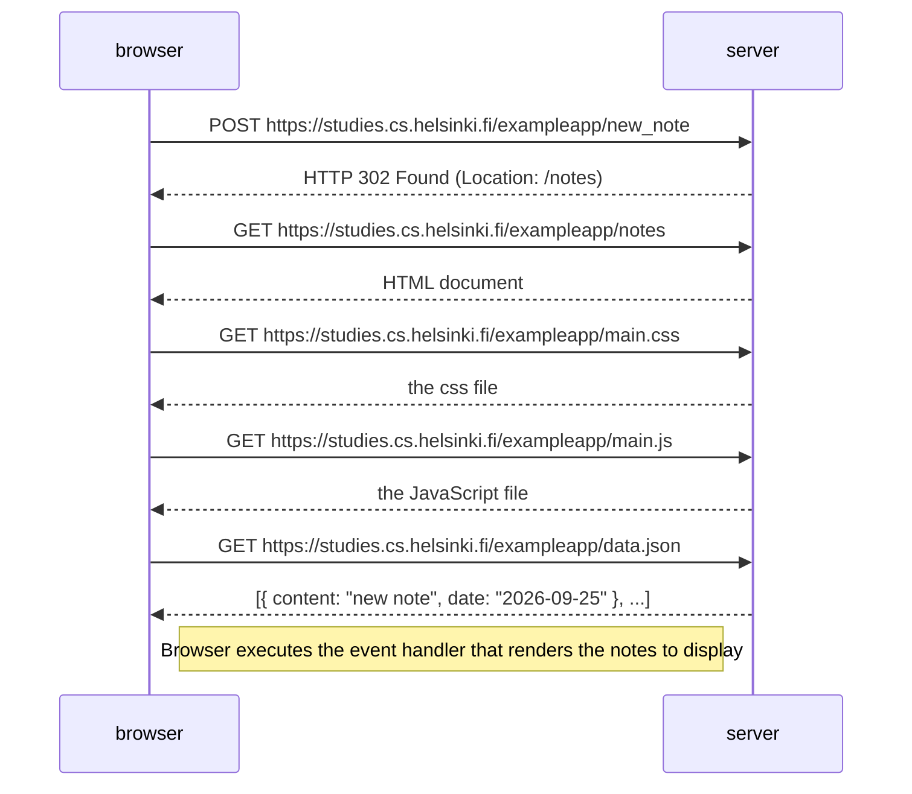

# 0.4:

```mermaid
sequenceDiagram
    participant browser
    participant server

    browser->>server: POST https://studies.cs.helsinki.fi/exampleapp/new_note
    server-->>browser: HTTP 302 Found (Location: /notes)

    browser->>server: GET https://studies.cs.helsinki.fi/exampleapp/notes
    server-->>browser: HTML document

    browser->>server: GET https://studies.cs.helsinki.fi/exampleapp/main.css
    server-->>browser: the css file

    browser->>server: GET https://studies.cs.helsinki.fi/exampleapp/main.js
    server-->>browser: the JavaScript file

    browser->>server: GET https://studies.cs.helsinki.fi/exampleapp/data.json
    server-->>browser: [{ content: "new note", date: "2026-09-25" }, ...]
    
    Note right of browser: Browser executes the event handler that renders the notes to display
```