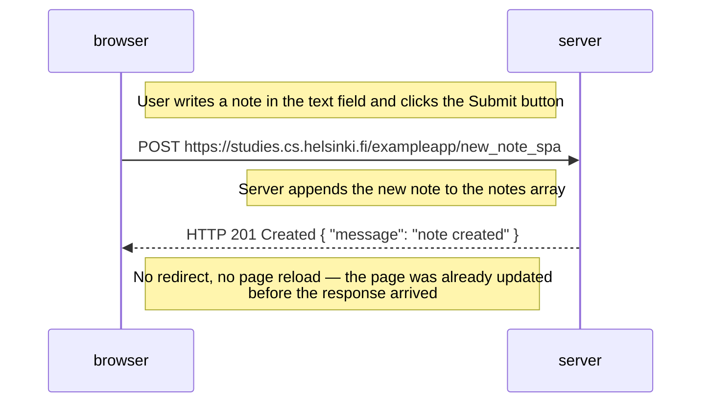

# 0.6:

```mermaid
sequenceDiagram
    participant browser
    participant server

    Note right of browser: User writes a note in the text field and clicks the Submit button

    browser->>server: POST https://studies.cs.helsinki.fi/exampleapp/new_note_spa

    Note left of server: Server appends the new note to the notes array

    server-->>browser: HTTP 201 Created { "message": "note created" }

    Note right of browser: No redirect, no page reload — the page was already updated<br/>before the response arrived
```